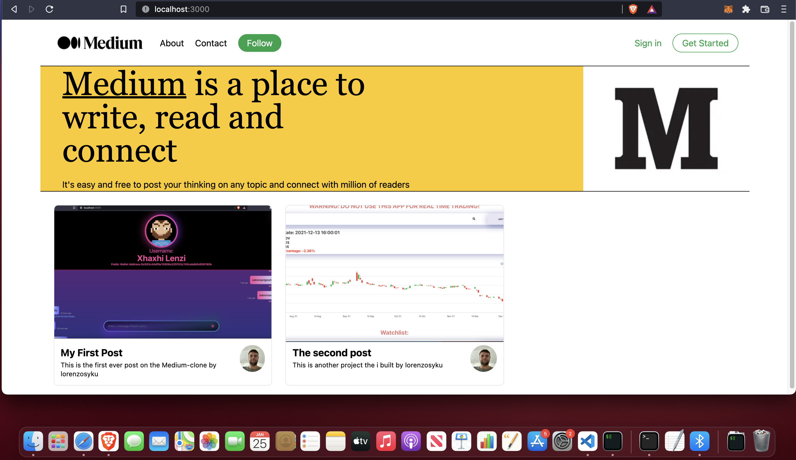
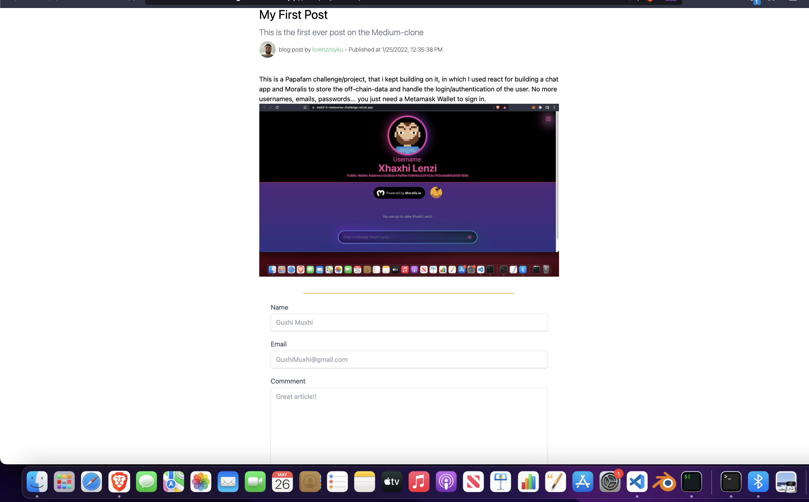

## Medium Clone
 
 

## Built With

- [NextJS](https://nextjs.org/) - The React Framework
  for Production.
  - Authentication flow with Twitter API using NextAuth
  - Server Side Rendering
  - Create API backend endpoints
- [TailwindCSS 3](https://tailwindcss.com/) - Rapidly build modern websites without ever leaving your HTML
- [TypeScript](https://www.typescriptlang.org/) - TypeScript is JavaScript with syntax for types.
  Intuitive SDKs and widgets for developers.
- [Sanity](https://www.sanity.io/) - Sanity.io is the unified content platform that powers better digital experiences.
  - Query data using GROQ query language
  - Add data to Sanity CMS Backend from the frontend using Mutations
  - Ability to BAN a tweet via the Sanity Platform

   

---